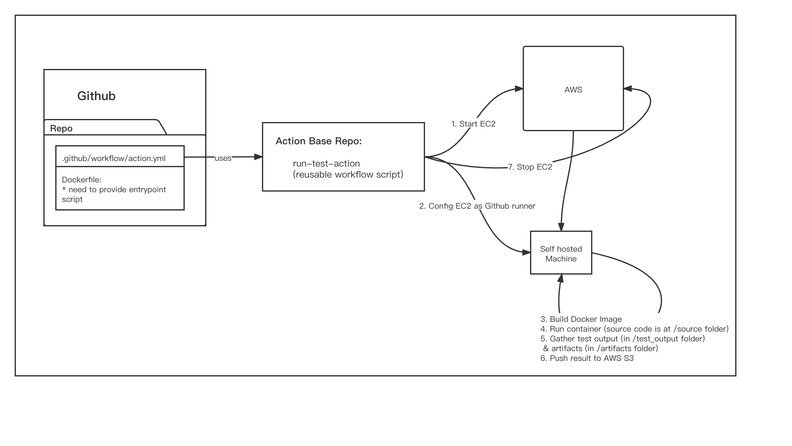

# run-test-action with On-Demand EC2

This repository contains some reusable workflows. These workflows help us start and stop EC2 machine in on-demand mode as github action runner dynamical.

## How does the workflow works



The workflow is defined in these steps:

1. Start EC2 machine
2. Config it as a Github runner
3. Build docker image with the dockerfile specified in workflow input
4. Run the container use the previous image
5. Gather test output (in /test_output folder) & artifacts (in /artifacts folder)
6. Push these two folders upon AWS S3 storage
7. Stop EC2 machine

Apart from that, this repo provide other two workflows:

1. Run the container which use the image in some docker repository instead of building it at running time
2. Directly run some commands instead of start a container

## Example
https://github.com/mrssss/ChickenFeather/tree/new-cmake-frame

To use the workflow in this repo, you need to define a docker image.

 The source code will be checkout into the `/source` folder, and the workflow will collect test results in the `/test_output` folder, artifacts in the `/artifacts`folder. 

When start container, the workflow will mount the  `/source` `/artifacts` folder, you just need to generate the files into these two folder.

### Add secrets

These scripts is required some secrets. Before running actions, you have to config it in github.

Github Repo -> Settings -> secrets -> New Repository secret

Add these secrets:

```
AWS_REGION
AWS_S3_BUCKET
AWS_ACCESS_KEY_ID
AWS_SECRET_ACCESS_KEY
GH_PERSONAL_ACCESS_TOKEN
```

### Define Dockerfile and run.sh

Firstly, put these two file in this `docker/test/unittest/` folder.

```sh
# docker/test/unittest/Dockerfile
FROM ubuntu:20.04 

ENV DEBIAN_FRONTEND=noninteractive LLVM_VERSION=13

RUN apt-get update \
    && apt-get install \
        apt-transport-https \
        apt-utils \
        ca-certificates \
        dnsutils \
        gnupg \
        iputils-ping \
        lsb-release \
        wget \
        --yes --no-install-recommends --verbose-versions \
    && export LLVM_PUBKEY_HASH="bda960a8da687a275a2078d43c111d66b1c6a893a3275271beedf266c1ff4a0cdecb429c7a5cccf9f486ea7aa43fd27f" \
    && wget -nv -O /tmp/llvm-snapshot.gpg.key https://apt.llvm.org/llvm-snapshot.gpg.key \
    && echo "${LLVM_PUBKEY_HASH} /tmp/llvm-snapshot.gpg.key" | sha384sum -c \
    && apt-key add /tmp/llvm-snapshot.gpg.key \
    && export CODENAME="$(lsb_release --codename --short | tr 'A-Z' 'a-z')" \
    && echo "deb [trusted=yes] https://apt.llvm.org/${CODENAME}/ llvm-toolchain-${CODENAME}-${LLVM_VERSION} main" >> \
        /etc/apt/sources.list

# initial packages
RUN apt-get update \
    && apt-get install \
        bash \
        fakeroot \
        ccache \
        curl \
        software-properties-common \
        --yes --no-install-recommends

RUN apt-get update \
    && apt-get install \
        bash \
        build-essential \
        ccache \
        cmake \
        curl \
        gdb \
        git \
        gperf \
        clang-${LLVM_VERSION} \
        clang-tidy-${LLVM_VERSION} \
        clang-format-${LLVM_VERSION} \
        lld-${LLVM_VERSION} \
        llvm-${LLVM_VERSION} \
        llvm-${LLVM_VERSION}-dev \
        libicu-dev \
        libreadline-dev \
        moreutils \
        ninja-build \
        pigz \
        rename \
        tzdata \
        --yes --no-install-recommends

# Install some library
RUN apt-get update \
    && apt-get install \
        libpoco-dev \
        libgtest-dev \
        --yes --no-install-recommends

# This symlink required by gcc to find lld compiler
RUN ln -s /usr/bin/lld-${LLVM_VERSION} /usr/bin/ld.lld


ENV CC=clang-${LLVM_VERSION}
ENV CXX=clang++-${LLVM_VERSION}
ENV LD=/usr/bin/ld.lld

# docker build -t qniu/chicken-unit-test:latest .
FROM qniu/chicken-builder:latest

RUN apt-get update \
    && apt-get install -y \
        xsltproc \
        --yes --no-install-recommends

COPY run.sh /run.sh

RUN chmod 0755 /run.sh

ENTRYPOINT ["/bin/bash", "/run.sh"]

```


```sh
# docker/test/unittest/run.sh
#!/bin/bash

function run_cmake 
{
    mkdir /build && cd /build && cmake /source
}

function run_build
{
    cd /build && cmake --build .
}

function run_unit_test
{
    cd /build && ./unit_tests --gtest_output=xml:result.xml
}

function generate_report
{
    xsltproc /source/utils/gtest2html/gtest2html.xslt result.xml > /test_output/result.html
}

run_cmake
run_build
run_unit_test
generate_report

```


### Define Github action workflow

Add a file named test_ec2_on_demand.yml in `.github/workflows` folder

```yaml
# .github/workflows/test_ec2_on_demand.yml
name: unit test
on: push
jobs:
  unit_test:
    uses: mrssss/run-test-action/.github/workflows/run_dockerfile.yml@main
    with:
      dockerfile: docker/test/unittest/Dockerfile
      context-directory: docker/test/unittest/
      ec2-instance-type: c4.xlarge
    secrets:
      AWS_ACCESS_KEY_ID: ${{ secrets.AWS_ACCESS_KEY_ID }}
      AWS_SECRET_ACCESS_KEY: ${{ secrets.AWS_SECRET_ACCESS_KEY }}
      AWS_REGION: ${{ secrets.AWS_REGION }}
      AWS_S3_BUCKET: ${{ secrets.AWS_S3_BUCKET }}
      GH_PERSONAL_ACCESS_TOKEN: ${{ secrets.GH_PERSONAL_ACCESS_TOKEN }}

```

### Execute Github action

Commit the changes and push it into github, the github will automatically detect the workflows define in `.github/workflows`.

So you don't need to do extra things, the workflow will be executed automatically.

## Another example

https://github.com/mrssss/ClickHouse/blob/master/.github/workflows/fast-test-on-demand.yml

